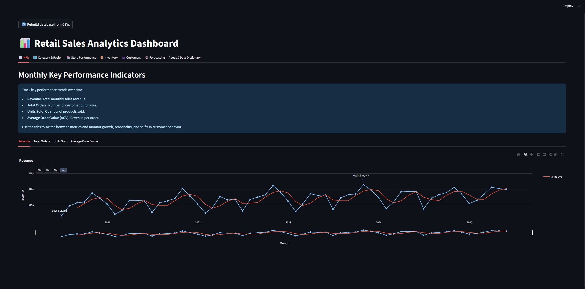
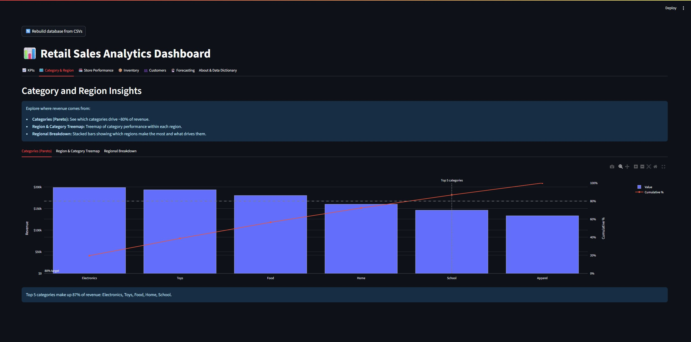
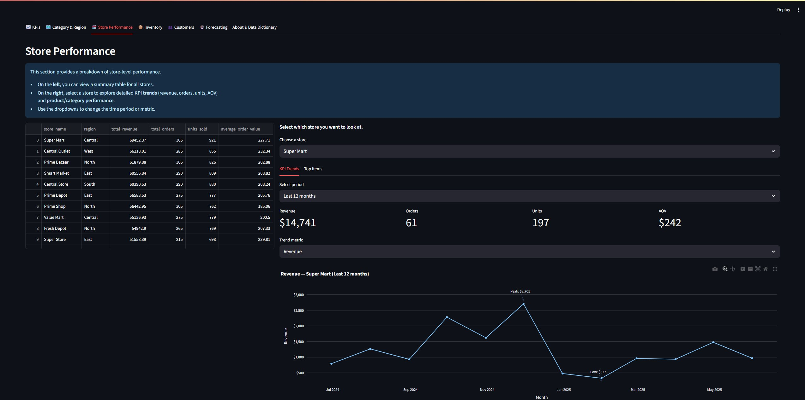
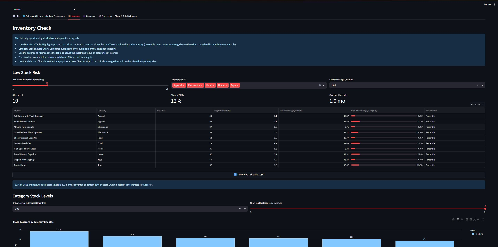
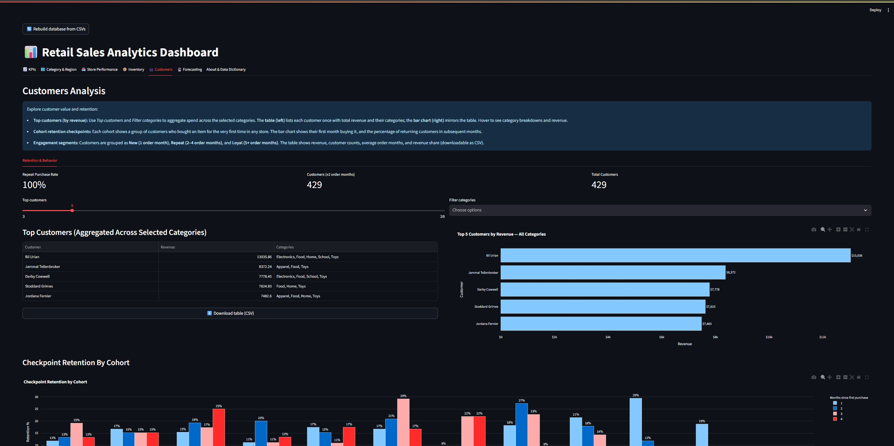
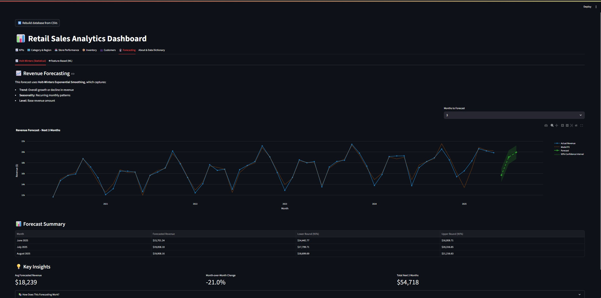
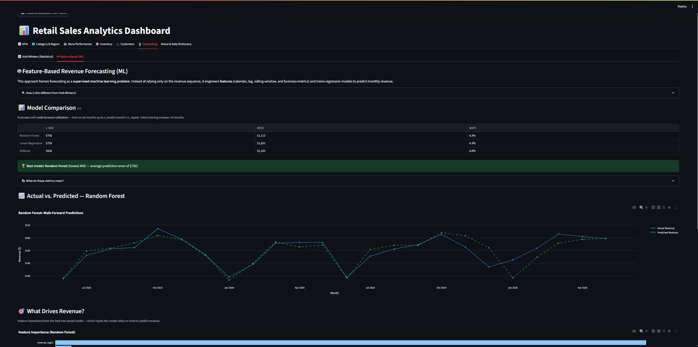
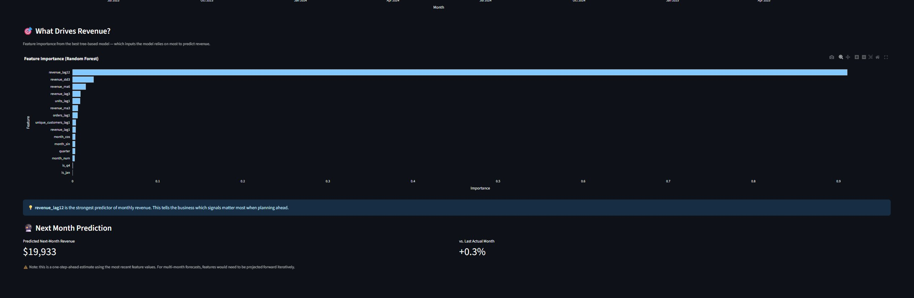
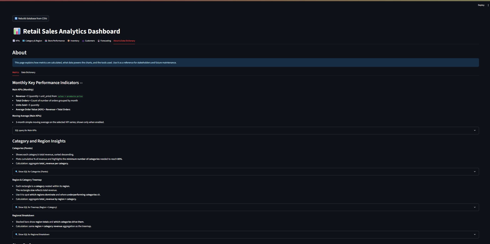

# Retail Sales Analytics Dashboard

An interactive **Streamlit + Plotly** dashboard for exploring retail sales data, inventory risks, store performance, customer retention, and **revenue forecasting**.  
The project uses **SQLite** as a lightweight analytical database, rebuilt automatically from CSV inputs.

Built as a **data science portfolio project** demonstrating SQL, Python, data visualization, business analytics, statistical modeling, and machine learning.

---

## 🚀 Features

### 1. **Monthly Key Performance Indicators (KPIs)**
- **Revenue** = Σ (quantity × price)
- **Total Orders** = Count of unique customer orders per month
- **Units Sold** = Σ (quantity)
- **Average Order Value (AOV)** = Revenue ÷ Orders
- **3-month moving averages** for trend smoothing
- **5 years of historical data** (June 2020 - May 2025)

### 2. **Category & Region Insights**
- **Pareto Chart** → Identify the top categories driving ~80% of revenue
- **Treemap** → Visualize how categories perform within each region
- **Stacked Bars** → Compare total regional revenue and category breakdown

### 3. **Store Performance**
- **Store summary table** with Revenue, Orders, and Units metrics
- **Individual store deep-dive** with KPI trends
- **Period filters** (last N months, all-time)
- **Top Categories & Products** per store

### 4. **Inventory Management**
- **Low-Stock Risk Table** → Identify SKUs at risk of stockouts using:
  - Bottom percentile of stock within category
  - Coverage below critical threshold (months of inventory)
- **Category Stock Levels Chart** → Visual coverage analysis
- **CSV export** for further analysis

### 5. **Customer Analysis**
- **Repeat Purchase Rate** tracking
- **Top Customers** by revenue (filterable by category)
- **Cohort Retention Analysis** → Track customer retention at months 1-4
- **Customer Segmentation:**
  - **New** (1 order month)
  - **Repeat** (2-4 order months)
  - **Loyal** (5+ order months)

### 6. **Revenue Forecasting**

#### **Statistical Forecasting (Holt-Winters)**
- **Adaptive model selection:**
  - 24+ months of data → Full seasonal model (trend + seasonality)
  - 12-23 months → Trend-only model
  - <12 months → Simple exponential smoothing
- **Interactive Plotly chart** with historical data, fitted values, forecast, and 95% confidence intervals
- **Forecast table** for next 1-6 months
- **Key metrics:** Average forecast, month-over-month change, total revenue

#### **Machine Learning Forecasting**
- **Feature engineering:** 15 features including:
  - Calendar features (month, quarter, Q4 flag, cyclical encoding)
  - Lag features (revenue 1/3/12 months back)
  - Rolling windows (3/6-month moving averages, volatility)
  - Business metrics (lagged orders, units, customers)
- **Model comparison:** Linear Regression vs Random Forest vs XGBoost
- **Walk-forward validation:** Proper time-series cross-validation (no data leakage)
- **Performance metrics:** MAE, RMSE, MAPE
- **Feature importance analysis:** Identify which factors drive revenue
- **Next-month prediction**

**Verified Results (on 60-month dataset):**
```
Linear Regression:  MAE = $759   MAPE = 4.3%
Random Forest:      MAE = $753   MAPE = 4.3%  🏆
XGBoost:            MAE = $836   MAPE = 4.8%
```

### 7. **About & Documentation**
- Data dictionary with table schemas
- Metric definitions and calculation formulas
- SQL query transparency (view all queries via expanders)

---

## 🛠️ Tech Stack

| Component | Technology | Purpose |
|-----------|-----------|---------|
| **Frontend/UI** | Streamlit | Interactive dashboard interface |
| **Visualization** | Plotly Express + Graph Objects | Charts, graphs, interactive visuals |
| **Database** | SQLite | Lightweight analytical database |
| **Data Processing** | Pandas + NumPy | ETL, aggregations, feature engineering |
| **Statistical Modeling** | Statsmodels (Holt-Winters) | Time-series forecasting |
| **Machine Learning** | scikit-learn + XGBoost | Supervised regression forecasting |
| **Caching** | Streamlit decorators | Performance optimization |
| **Version Control** | Git + GitHub | Code and SQL query versioning |

---

## 📂 Project Structure

```
├── app.py                      # Main Streamlit dashboard
├── forecasting.py              # Holt-Winters exponential smoothing module
├── ml_forecasting.py           # Feature-based ML forecasting module
├── retail_sales.db             # SQLite database (auto-generated from CSVs)
├── csv_files/                  # Source data (5 CSV files)
│   ├── customers.csv           # 498 customers
│   ├── inventory.csv           # 5,000 rows (60 months)
│   ├── products.csv            # 100 products across 6 categories
│   ├── sales.csv               # 5,000 transactions (60 months: Jun 2020 - May 2025)
│   └── stores.csv              # 20 stores across 4 regions
├── queries/                    # SQL queries (version-controlled as .txt)
│   ├── main_kpi_summary.txt
│   ├── all_stores_performance.txt
│   ├── store_kpi_summary.txt
│   ├── top_category.txt
│   ├── region_category_rev.txt
│   ├── inventory_tab_low_stock_risk.txt
│   ├── inventory_category_stock_levels.txt
│   └── customer_order_data.txt
├── requirements.txt            # Python dependencies
├── .gitignore
└── README.md
```

---

## 📊 Dataset Overview

- **Time Range:** June 2020 - May 2025 (60 months / 5 years)
- **Sales Transactions:** 5,000 rows
- **Products:** 100 SKUs across 6 categories
- **Stores:** 20 locations in 4 regions
- **Customers:** 498 unique customers
- **Data Characteristics:**
  - ~5% year-over-year revenue growth
  - Seasonal patterns (Q4 spike ~15-20% above baseline)
  - Monthly noise and variation

---

## ⚙️ Setup & Run

### Prerequisites
- Python 3.8+
- pip

### Installation

1. **Clone the repository:**
   ```bash
   git clone https://github.com/Rotimi779/Retail-Sales-Analytics.git
   cd Retail-Sales-Analytics
   ```

2. **Install dependencies:**
   ```bash
   pip install -r requirements.txt
   ```

3. **Run the dashboard:**
   ```bash
   streamlit run app.py
   ```

4. **Access the app:**
   - The app will open automatically in your browser
   - Default URL: `http://localhost:8501`

### First-Time Setup
- The SQLite database (`retail_sales.db`) is auto-generated from CSV files on first run
- Use the **"🔄 Rebuild database from CSVs"** button in the sidebar to refresh data

---

## 📸 Screenshots

### 1. Monthly Key Performance Indicators

*Track revenue, orders, units sold, and AOV with 3-month moving averages across 5 years of historical data*

---

### 2. Category & Region Analysis

*Pareto chart showing top 5 categories driving 87% of revenue, with cumulative percentage line*

---

### 3. Store Performance Deep-Dive

*Individual store analysis with KPI metrics, trend charts, and period selectors (Last 12 months shown)*

---

### 4. Inventory Management

*Low-stock risk table flagging 10 SKUs (12% of inventory) with percentile-based detection and coverage metrics*

---

### 5. Customer Analytics & Retention

*Top customers by revenue, cohort retention checkpoints, and 100% repeat purchase rate across 429 customers*

---

### 6. Revenue Forecasting - Holt-Winters

*Statistical forecasting using Holt-Winters exponential smoothing with trend, seasonality, and 95% confidence intervals*

---

### 7. Revenue Forecasting - ML Model Comparison

*Feature-based ML forecasting comparing Linear Regression, Random Forest, and XGBoost with walk-forward validation*

---

### 8. Feature Importance Analysis

*Random Forest feature importance showing revenue_lag12 (same month last year) as the strongest predictor*

---

### 9. About & Data Dictionary

*Comprehensive documentation of metrics, calculations, and SQL methodology with query transparency*

---

## 🎯 Key Insights & Analytics

### Business Analytics
- **Pareto Analysis:** Identify top categories driving 80% of revenue
- **Inventory Optimization:** Flag low-stock SKUs before stockouts occur
- **Customer Segmentation:** Track customer lifecycle from New → Repeat → Loyal
- **Store Performance:** Compare 20 stores across 4 regions

### Forecasting & Predictive Analytics
- **Statistical Forecasting:** Holt-Winters captures trend and seasonality automatically
- **ML Forecasting:** Random Forest achieves 4.3% MAPE (Mean Absolute Percentage Error)
- **Feature Importance:** Revenue from same month last year is the strongest predictor (91% importance)
- **Walk-Forward Validation:** Proper time-series CV ensures no data leakage

---

## 📈 Use Cases

This dashboard answers real business questions:

1. **Revenue Planning:** "What will our revenue be in Q4?"
2. **Inventory Management:** "Which products are at risk of stockout?"
3. **Customer Retention:** "Are customers coming back after their first purchase?"
4. **Store Operations:** "Which stores are underperforming?"
5. **Category Strategy:** "Which product categories should we prioritize?"
6. **Seasonal Planning:** "How much should we stock for the holiday season?"

---

## 🧠 Technical Highlights

### Data Engineering
- **Automated ETL:** CSV → SQLite pipeline with data validation
- **Modular SQL:** Queries stored as `.txt` files for version control and reusability
- **Efficient caching:** Streamlit decorators prevent redundant database queries

### Forecasting Methodology
- **Adaptive Holt-Winters:** Model selection based on data availability
- **Feature Engineering:** 15 engineered features from raw transaction data
- **Time-Series Validation:** Walk-forward validation prevents look-ahead bias
- **Model Comparison:** Systematic evaluation of 3 ML models with standard metrics

---

## 🚀 Future Enhancements

- [ ] Deploy to Streamlit Cloud for public access
- [ ] Add customer lifetime value (CLV) predictions
- [ ] Implement product recommendation engine
- [ ] Add anomaly detection for unusual sales patterns
- [ ] Export forecasts to Excel/PDF reports
- [ ] Add user authentication for multi-tenant use

---

## 📝 License

This project is open source and available for educational and portfolio purposes.

---

## 👤 Author

**Rotimi Ajayi**  
Data Science Portfolio Project

- GitHub: [@Rotimi779](https://github.com/Rotimi779)
- Repository: [Retail-Sales-Analytics](https://github.com/Rotimi779/Retail-Sales-Analytics)

---

## 🙏 Acknowledgments

- **Dataset:** Synthetic retail data generated for demonstration purposes
- **Forecasting Methods:** 
  - Holt-Winters exponential smoothing (Statsmodels)
  - Gradient boosting (XGBoost)
  - Random forests (scikit-learn)
- **Visualization:** Plotly for interactive charts
- **Framework:** Streamlit for rapid dashboard development

---

## 📚 Resources

- [Streamlit Documentation](https://docs.streamlit.io/)
- [Plotly Python Documentation](https://plotly.com/python/)
- [Statsmodels Time Series](https://www.statsmodels.org/stable/tsa.html)
- [XGBoost Documentation](https://xgboost.readthedocs.io/)
- [Retail Analytics Best Practices](https://en.wikipedia.org/wiki/Retail_analytics)

---

*Last Updated: May 2026*
